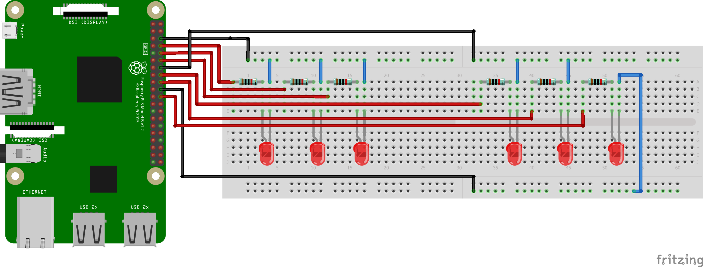
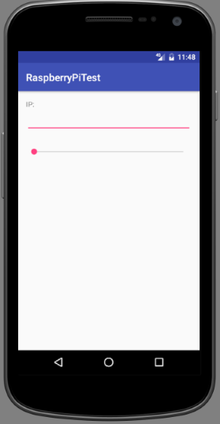

Simple project for controling LEDs from Android app
===

The idea
---

The idea behind this project is to control LEDs from Android app. LEDs are connected to GPIO of RPi. On RPi there is a webservice allowing to control LEDs. Android app has a *Slider* which has a callback which calls RPis webservice.

What hardware you need
---

- Raspberry PI
- 6 LEDs
- 6 resistors

What software you need
---

- Text editor
- SSH client
- Android Studio

Circuit
---

|PIN|Type|Destination|
|---|---|---|
|6|Ground|Ground 1|
|8, 10, 12|Outputs|LED 1, 2, 3|
|14|Ground|Ground 2|
|16, 18|Outputs|LED 4, 5|
|20|Ground|Ground 3|
|22|Output|LED 6|

Python webservice
---

See *python/go.py*:

- Starts `HTTPServer` and waits for requests
- After *GET* receivded, parse `n` param and turn on LEDs

Android app
---

See *android*

- View with `EditText` (for IP) and `Seekbar`
- `Seekbar` has a `setOnSeekBarChangeListener` listener which calls webservice

