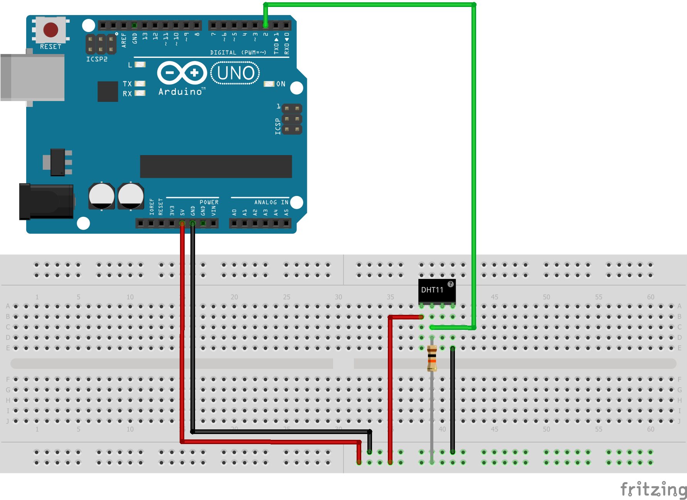

Simple temperature/humidity reader
===

What hardware you need
---

- Arduino UNO
- [DHT11](www.micropik.com/PDF/dht11.pdf) or [DHT22](https://www.sparkfun.com/datasheets/Sensors/Temperature/DHT22.pdf)

What software you need
--

- Arduino IDE
- [DHT-sensor-library-1.3.0](https://github.com/adafruit/DHT-sensor-library)
- [Adafruit_Sensor-1.0.2.zip](https://github.com/adafruit/Adafruit_Sensor)

Idea
---

Read temperature and humidity and send it via serial port to PC.

Circuit
---

Code
---

See [code](code/code.ino)
